# Redis Study
學習之後，製作成筆記，方便日後使用時復習

# 在Linux 安裝 Redis
1、下載安裝包
 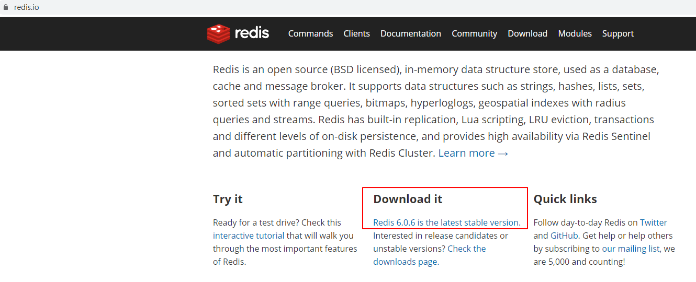
 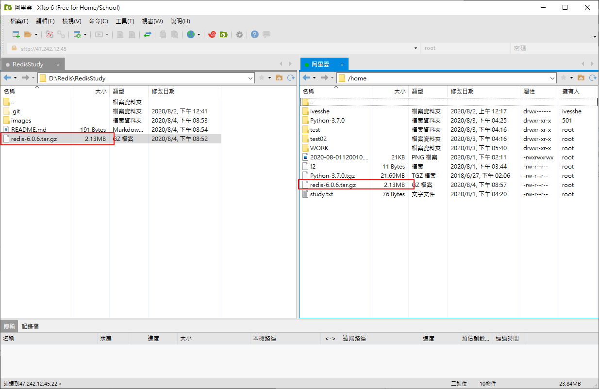

```shell
mv redis-6.0.6.tar.gz /opt
cd /opt
ls
tar -zxvf redis-6.0.6.tar.gz 
```

 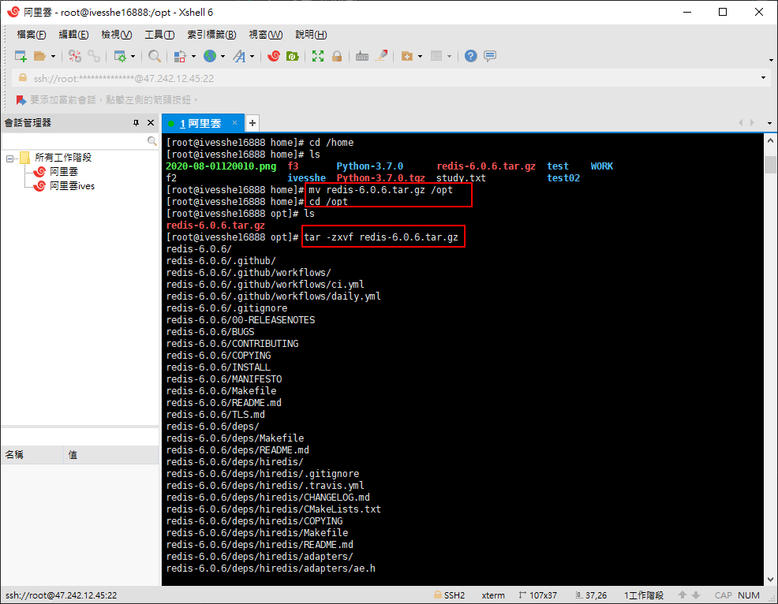
 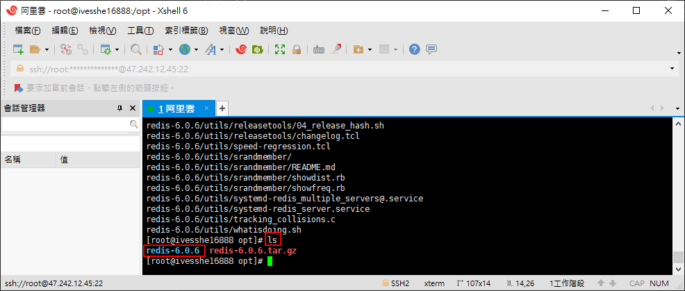

 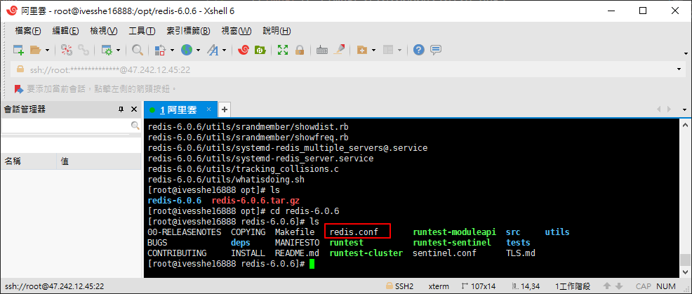

```shell
yum install gcc-c++
```
 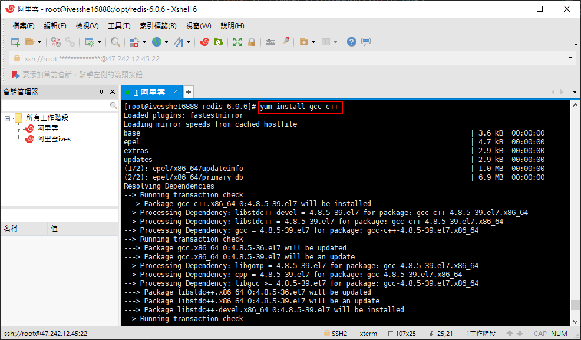
 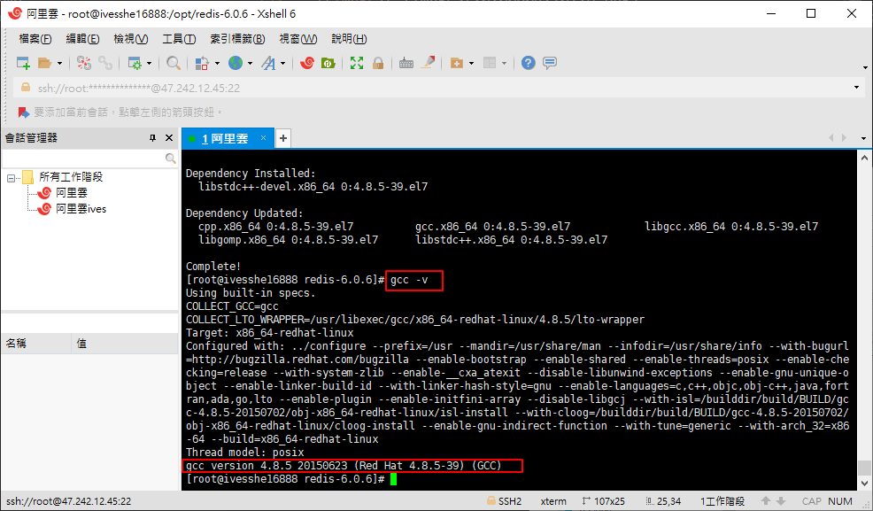

```shell
make
```
**這裡因為下載最新版的6.0.6的版本，make之後報錯無法解決，有重新安裝回至5.0.8的版本**
 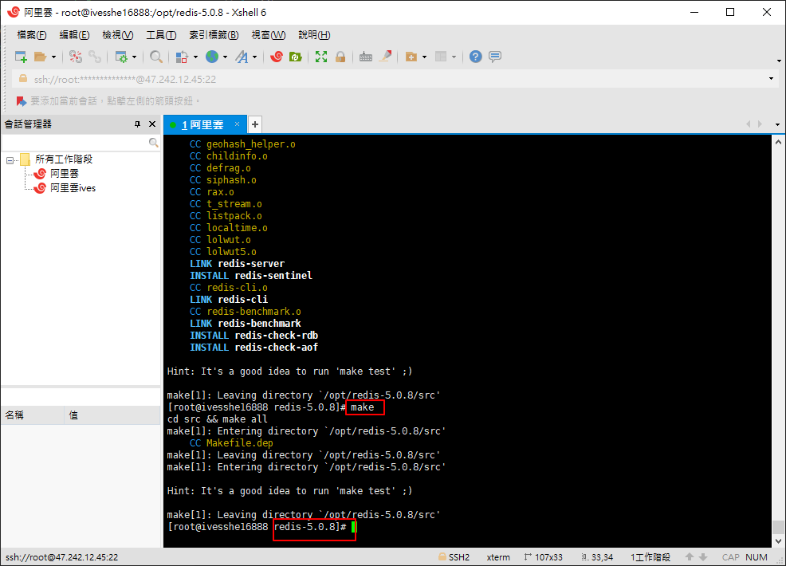

```shell
make install
```
 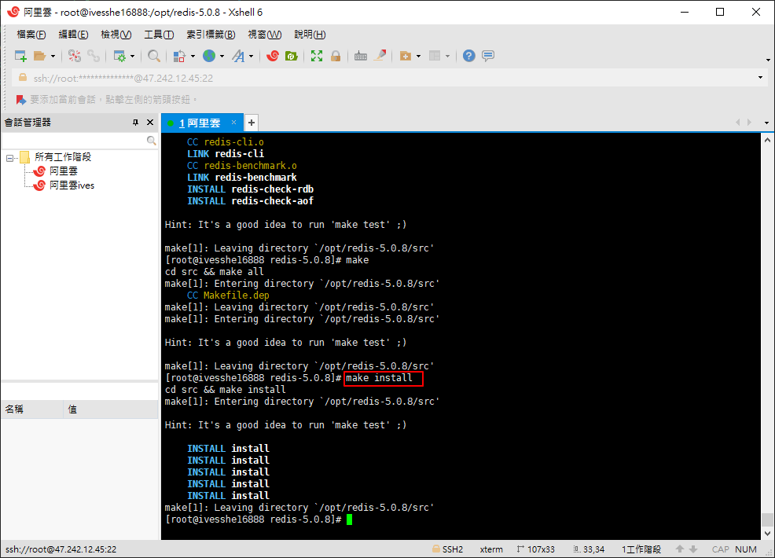

redis的默認安裝路徑 usr/local/bin
 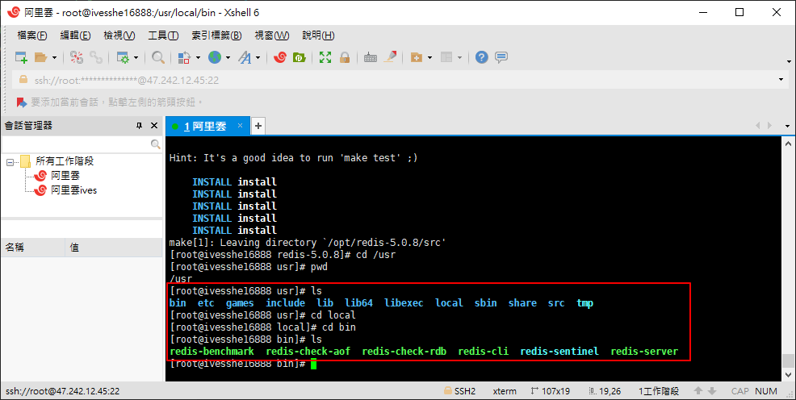

拷貝一份配置文件，確保原配置文件的安全
 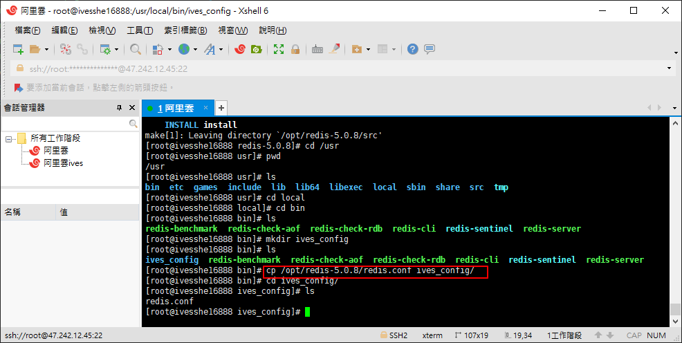

開啟配置文件
 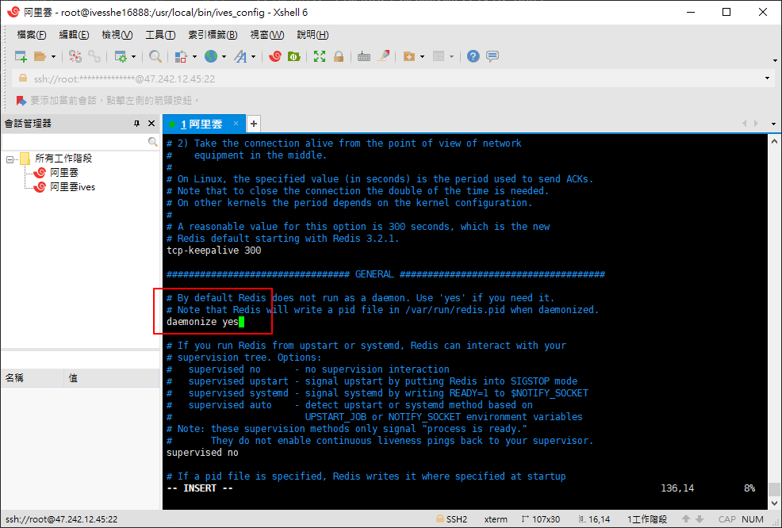

修改配置文件
 

通過指定的配置文件啟動
 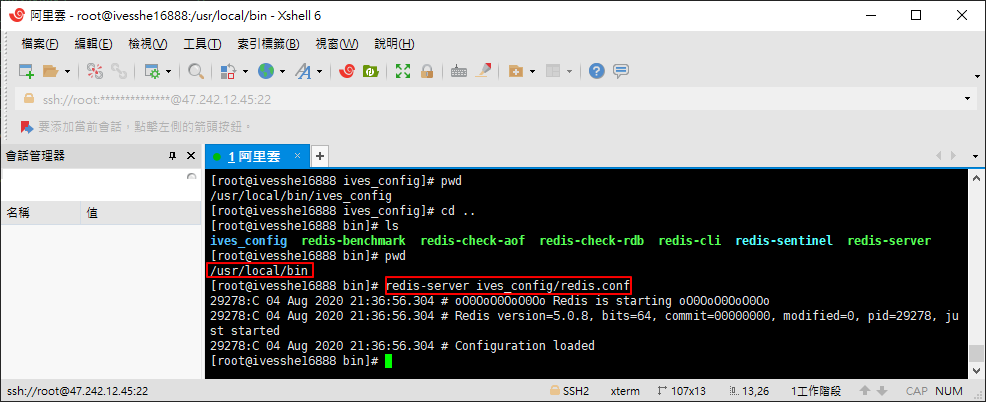

使用redis客戶端連接
 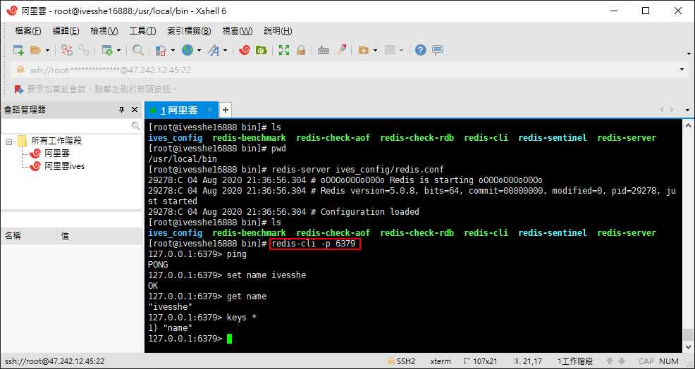

查看redis是否開啟
 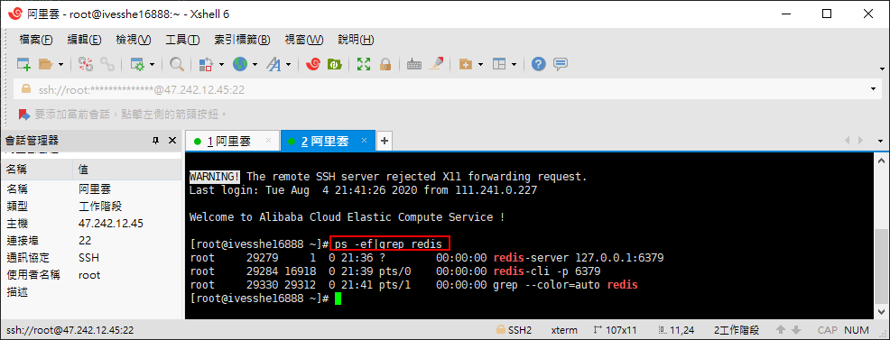

關閉redis
 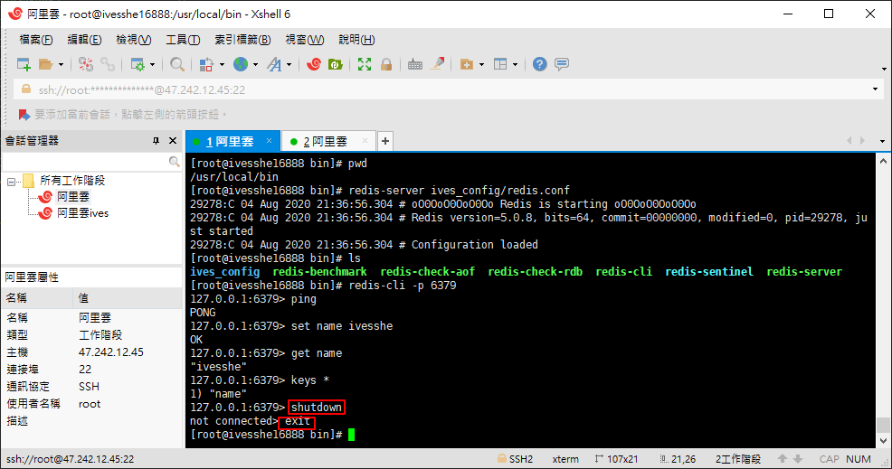

再次查看redis是否開啟
 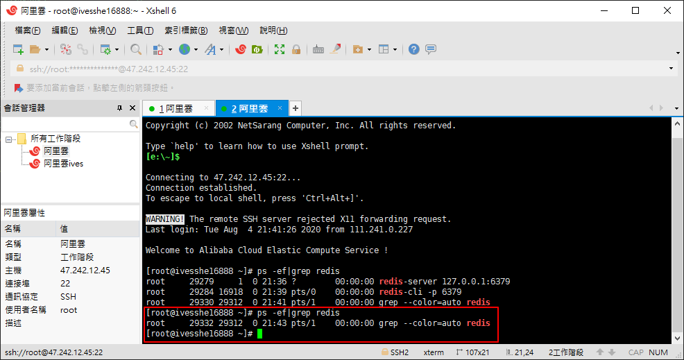