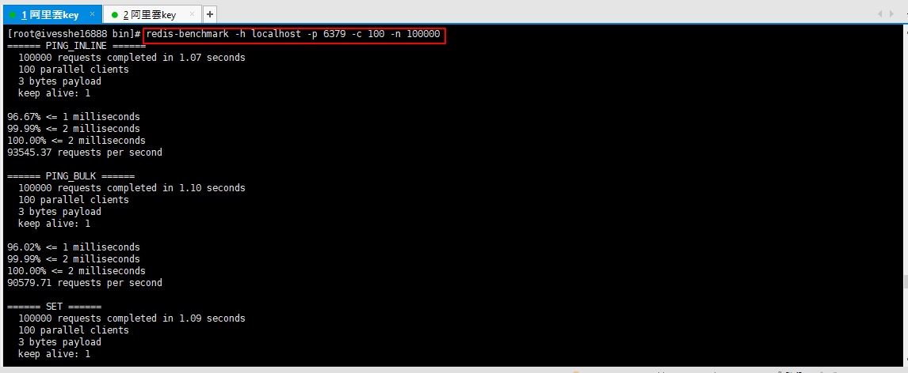
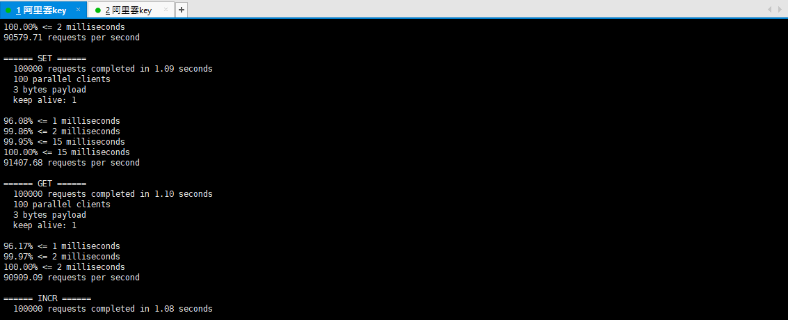
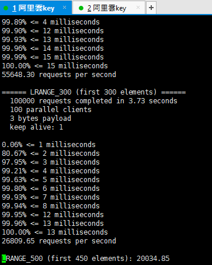
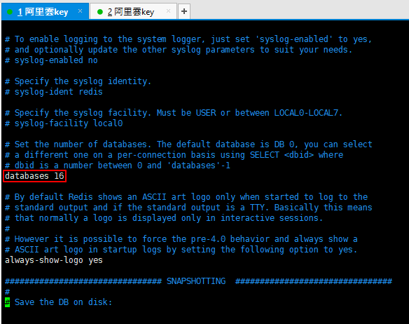
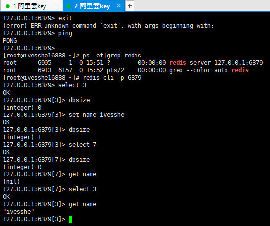

# Redis Study
學習之後，製作成筆記，方便日後使用時復習

# 在Linux 安裝 Redis
1、下載安裝包
 
 

```shell
mv redis-6.0.6.tar.gz /opt
cd /opt
ls
tar -zxvf redis-6.0.6.tar.gz 
```

 
 

 

```shell
yum install gcc-c++
```
 
 

```shell
make
```
**這裡因為下載最新版的6.0.6的版本，make之後報錯無法解決，有重新安裝回至5.0.8的版本**
 

```shell
make install
```
 

redis的默認安裝路徑 usr/local/bin
 

拷貝一份配置文件，確保原配置文件的安全
 

開啟配置文件
 

修改配置文件
 

通過指定的配置文件啟動

 ```shell
redis-server /usr/local/bin/ives_config/redis.conf
```

 

使用redis客戶端連接

```shell
redis-cli -p 6379
```

 

查看redis是否開啟
 

關閉redis
 

再次查看redis是否開啟

```shell
ps -ef|grep redis
```

 

 ```shell
 # 測試：100個並發連接，100000請求
redis-benchmark -h localhost -p 6379 -c 100 -n 100000
 ```







# 基礎的知識

redis默認有16個數據庫



默認使用第0個，可以使用select切換

```shell
select 3
dbsize
set name ivesshe
get name
```



查看數據庫所有key
```shell
keys *
```

清空當前數據庫
```shell
flushdb
```

清空所有數據庫
```shell
flushall
```

> Redis是單線程的

Redis是基於內存操作的，CPU不是Redis性能瓶頸，Redis性能瓶頸是根據機器的內存和網絡頻寬

Redis是C語言寫的

# 五大數據類型

[參考文檔](http://redis.cn/)

## Redis-Key

檢查key是否存在
```shell
exists key
```

移除key
```shell
move key 1
```

設定key過期時間
```shell
expire key 秒數
```

查看key剩餘過期時間
```shell
ttl key
```

查看該key的value的數據類型
```shell
type key
```

在該key的value追加字符串
```shell
append key " "
```

獲取該key的value內容的長度
```shell
strlen key " "
```

## String

該key的value內容 自加1
```shell
incr key
```

該key的value內容 自減1
```shell
decr key
```

該key的value內容 加步長
```shell
incrby key 步長
```

該key的value內容 減步長
```shell
decrby key 步長
```

讀範圍的value
```shell
getrange key 0 n
```

設定範圍的value，n為位置
```shell
setrange key n "要替換的值"
```

設置過期時間
```shell
# setex (set with expire)
setex key value 秒數
```

不存在再設置
```shell
# setnx (set if no exist) 
setnx key value
```

批量設置
```shell 
mset k1 v1 k2 v2 k3 v3
```

批量取值
```shell 
mget k1 k2 k3
```

批量設置(不存在再設置)
```shell 
# 是一個原子性的操作，要嘛一起成功，要嘛一起失敗
msetnx k1 v1 k2 v2 k3 v3 k4 v4
```

對象
```shell 
# 設置一個user:1 對象 值為json字符來保存對象
set user:1{name:ivesshe,age:20}
```

這裡的key是一個巧妙的設計： user:{id}:{filed}，如此設計在Redis中完全ok的

另一種對象設置方法
```shell 
mset user:1:name ivesshe user:1:age 18
mget user:1:name user:1:age
```

先get然後再set
```shell 
# 如果不存在值，則返回nil
# 如果存在值，獲取原來的值，並設置新的值
getset key value
```

**String類似的使用場景：value除了是我們的字符串還可以是數字**
- 計數器
- 統計多單位的數量

## List

基本的數據類型，列表

設置list
```shell
# 設定一個值或者多個值，插入到列表頭部(左)
lpush list one
lpush list two
lpush list three
lrang list 0 -1
```

取值list
```shell
lrange list 0 -1
```

設置list
```shell
# 設定一個值或者多個值，插入到列表尾部(右)
rpush list four
```

移除list元素
```shell
# 移除list的第一個元素
lpop list

# 移除list的最後一個元素
rpop list
```

通過下標獲得list中的某一個值
```shell
lindex list n

rindex list n
```

